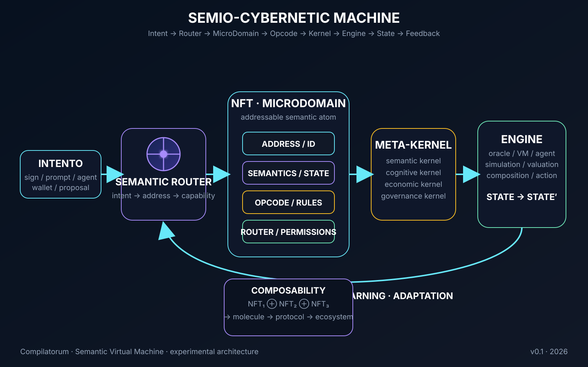

# Máquina Cibernética Semiótica

## Máquina-mãe

**Intent → Router → MicroDomain → Opcode → Kernel → Engine → State → Feedback**

O diagrama trata cada NFT como um **microdomínio semiótico endereçável e composável**, contendo identidade, semântica, estado, opcode, regras, permissões e capacidade de roteamento.

### Formalismo

\[
D_i = \langle A_i, \Sigma_i, O_i, S_i, R_i, P_i \rangle
\]

\[
I \rightarrow R(I) \rightarrow D_i \rightarrow O_i \rightarrow K \rightarrow E \rightarrow S_{t+1} \rightarrow F
\]

### Leitura cibernética

- **Intent** — sinal de entrada.
- **Semantic Router** — interpretação e encaminhamento.
- **NFT / MicroDomain** — unidade de capacidade semântica.
- **Opcode** — transformação solicitada.
- **Meta-Kernel** — regras de execução e coordenação.
- **Engine** — runtime/oráculo/VM/agente.
- **State′** — estado transformado.
- **Feedback** — observação, aprendizagem e adaptação.
- **Composability** — microdomínios podem formar moléculas, protocolos e ecossistemas.

> **Princípio:** o token não precisa ser apenas representação de um objeto; pode ser uma unidade de computação semiótica.

